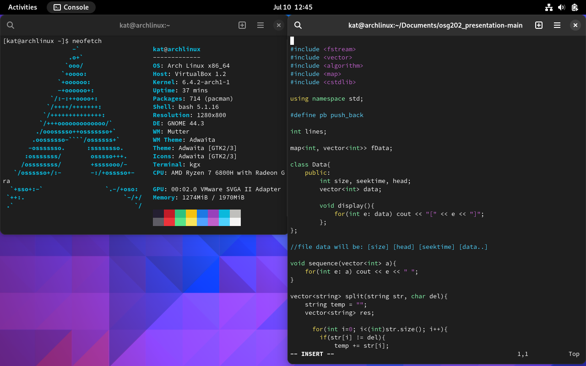

# osg202_presentation
Repo cho môn OSG202

Chương trình mô phỏng thuật toán First Come First Search và Elevator
(Illustration Program for FCFS and Elevator Algorithm)



Report:
  - Bản báo cáo nằm ở file [PDF](osg202.pdf)

## Cách cài đặt
### Cài đặt hệ điều hành
  - Tôi sử dụng phần mềm [Oracle VM Virtual Box](https://www.virtualbox.org/) của Oracle để chạy hệ điều hành.
  - Hệ điều hành: [ArchLinux](https://archlinux.org/)
  - GCC version: GCC 13.1.1 hoặc bạn có thể update bằng lệnh
    ```
    sudo pacman -Syu
    sudo pacman -Ss gcc
    sudo pacman -S gcc
    ```
    Khi cài đặt xong có thể check phiên bản bằng lệnh:
    ```
    gcc --version
    ```
### Chạy chương trình
Download và giải nén file về máy.
Bật Console và nhập:

```
  cd path-to-folder
  ./out.o
```

Source code sẽ nằm trong file [presentation.cpp](presentation.cpp)
